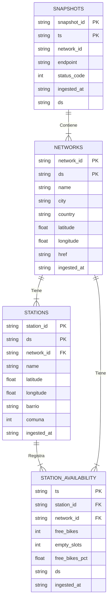

# TP Final - G07 
---

## Integrantes

- Gonzalo Cárdenas (@Zagon22)
- Gabriela Gattas (@Gabi6285)
- Gastón Rossi (@torino05)
- Morena Stolerman (@Morenastolerman)
- Camila Vidoni (@camilavidoni7)
- Alex Flores (@afloreschoquehuanca-byte)

## API elegida

- **Nombre**: `CityBikes API`
- **URL**: `https://docs.citybik.es/api`
- **Descripcion**: `Proporciona datos en tiempo real sobre el estado de estaciones de bicicletas públicas en distintas ciudades del mundo. Devuelve información como cantidad de bicicletas disponibles, slots vacíos, coordenadas geográficas y timestamp de actualización.`
- **Auth**: `Sin autenticación (no requiere API key para uso básico).`
- **Refresh**: `Cada 2–5 minutos (actualización frecuente según la red de bicicletas).`
- **Frecuencia de ingesta del DAG**: cada 5 minutos.

## Modelo de datos

El proyecto implementa una arquitectura analítica basada en la **Arquitectura Medallion**, diseñada para monitorear el sistema EcoBici del Gobierno de la Ciudad de Buenos Aires (GCBA).

### Bronze

La capa Bronze almacena los datos crudos obtenidos de la API CityBikes, conservando el payload original mediante una ingesta automatizada por Airflow (cada 5 minutos). Los archivos JSON obtenidos se almacenan inicialmente en una carpeta Landing y, una vez procesados exitosamente, se trasladan a Processed para garantizar trazabilidad y reproducibilidad. Se implementa una estrategia de idempotencia delete-insert basada en el timestamp de ejecución.

**Tablas generadas:**
* `bronze.networks`: Snapshot de redes disponibles en CityBikes.
* `bronze.stations`: Snapshot del estado de estaciones (ubicación, disponibilidad).
* `bronze.snapshots`: Trazabilidad de los requests HTTP realizados a la API.

**Metadatos de auditoría (agregados a todas las tablas):**
* `ts`: Timestamp lógico de la corrida del DAG (clave de partición).
* `ds`: Fecha lógica de la corrida.
* `source_url`: Endpoint de origen consultado.
* `ingested_at`: Momento real de la ingesta.

* **Evolución del esquema:** incorporación automática de nuevas columnas detectadas en la fuente mediante sentencias `ALTER TABLE`, evitando reconstrucciones completas de la capa.

### Silver

En esta capa se aplican estrictas reglas de calidad impulsadas de manera declarativa por el contrato de datos ([Ver contrato Silver](./data/contracts/silver_contracts.yaml)).

**Transformaciones aplicadas:**
* **Validación y Tipado (Casting):** Conversión automática de variables (ej. `free_bikes` a INTEGER, coordenadas a FLOAT).
* **Quarantine Table:** Los registros que violan las reglas de negocio (ej. cantidades negativas de bicicletas o coordenadas anómalas) se aíslan en `silver.quarantine` para no contaminar la capa analítica.
* **Integridad Físico-Lógica:** Generación dinámica de Claves Primarias (PK) y Foráneas (FK) en PostgreSQL.
* **Enriquecimiento Geográfico:** Cruce espacial de los datos con el archivo semilla `station_barrios.csv` para anexar barrio y comuna a cada estación.
* **Métricas Derivadas:** Cálculo del porcentaje de disponibilidad (`free_bikes_pct`) fila a fila para cada snapshot.
* **Historicidad:** Implementación de SCD de tipo 2 para preservar registros del pasado (relevantes para entender la evolución de la red en el tiempo).
* **Evolución del contrato:** Las nuevas columnas definidas en el contrato se incorporan automáticamente sin necesidad de recrear tablas.

**Diagrama Entidad Relación.**



### Gold

La capa Gold expone un modelo dimensional (Esquema Estrella) estructurado específicamente para alimentar el dashboard en Streamlit, definido mediante `gold_contracts.yaml`. ([Ver contrato Gold](./data/contracts/gold_contracts.yaml)).

**Modelo Dimensional:**
* **Dimensiones:** `dim_time` (desglose temporal granular), `dim_zona` (barrio y comuna) y `dim_estacion` (atributos estáticos y ubicación).
* **Métricas principales expuestas por las tablas de hechos:**
    * Bicicletas promedio disponibles por hora.
    * Slots promedio disponibles por hora.
    * Disponibilidad promedio de bicicletas (%).
    * Porcentaje de tiempo flageada como: 1) "devolución" (más slots libres); 2) "alquiler" (más bicicletas disponibles); 3) "equilibrada" (biciletas disponibles ~= slots libres).
* **Hechos (Facts):**
    * `fact_estado_actual_estacion`: Tabla de "última milla" (último snapshot) para monitoreo operativo y mapas en tiempo real.
    * `fact_ocupacion_por_hora`: Tabla histórica agregada por: 
      * las cantidades promedio de bicicletas y de slots por estación (`free_bikes_promedio` y `empty_slots_promedio`); 
      * los porcentajes promedio, máximo y mínimo de disponibilidad de bicicletas (`free_bikes_pct_promedio`, `free_bikes_pct_maxima` y `free_bikes_pct_minimo`); 
      * y los porcentajes en que cada estación fue "flageada" como "devolución", "equilibrada" y "alquiler" (`porcentaje_tiempo_devolucion`, `porcentaje_tiempo_equilibrada` y `porcentaje_tiempo_alquiler`).


**Preguntas de negocio que responde el Dashboard:**
1.  **¿Cuál es el estado operativo actual de la red?** (KPIs de bicis, slots y estaciones, complementado con un mapa interactivo que clasifica las estaciones según su perfil funcional en el último snapshot).
2.  **¿En qué momentos del día varía la disponibilidad?** (Franjas horarias y se destacan las horas pico con menor cantidad de bicis o slots).
3.  **¿Qué zonas tienen más disponibilidad de bicicletas?** (Ranking discriminado por "Barrio" o "Comuna").
4.  **¿Cuál es el perfil funcional de cada estación?** (Cada estación se clasifica como devolución, alquiler o equilibrada, mostrando los Top 10 más consistentes en cada categoría).


---

## Como levantar el stack

```bash
cd TpFinal/grupos/G07/
cp .env.example .env
docker compose up -d --build
# Esperar ~30s a que Airflow termine de inicializar
```
**Accesos**:
- Airflow UI: http://localhost:8081 (`admin` / `admin`)
- Dashboard (Gold): http://localhost:8501
- Postgres: `localhost:5432` (user/pass en `.env`)

**Apagar**:
```bash
docker compose down            # apaga, conserva datos
docker compose down -v         # apaga y BORRA volumenes (cuidado)
```

## Estructura del proyecto

Ver la sección **"Esqueleto de entrega"** en [`TpFinal/grupos/README.md`](../README.md)

