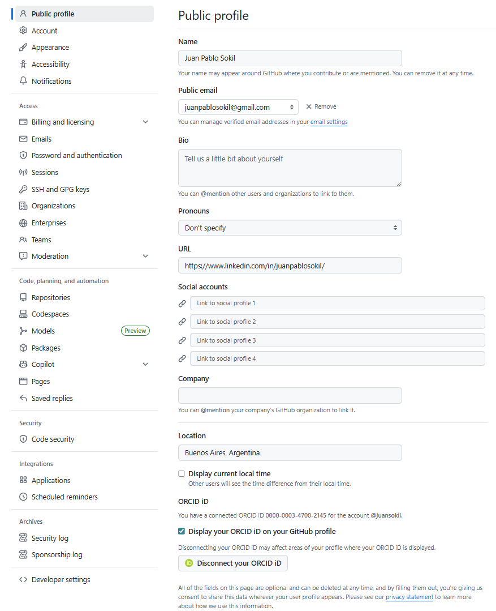

# Clase 01: Ingeniería de Datos — Data Pipelines - Arquitectura Medallion

> **Material de la clase**:
> - [`clase01.ipynb`](clase01.ipynb) — desarrollo teórico (Data Engineering, jerarquía del dato, modelado, pipelines, Arquitectura Medallion).
> - Este README — entrega práctica: primer push con Git.

---

## 🎯 Objetivo de esta entrega
Realizar tu primer **push con Git** al repositorio de la materia.

---

## 🚀 Mi primer push con Git

**Paso 0 — Registro en el Onboarding**
1. Andá a [https://asistencia-api-unsam-production.up.railway.app/unirse](https://asistencia-api-unsam-production.up.railway.app/unirse)
2. Completá con tu Nombre, Email y **Usuario de GitHub**.
3. Código de clase: se les da durante la clase.
4. Revisá tu email y aceptá la invitación de GitHub.

> **Nota**: el repositorio es público (cualquiera lo puede ver), pero solo podés subir contenido (push) si aceptaste la invitación.

---

**Paso 1 — Cloná el repositorio**

Ubicate primero en una carpeta donde quieras tener el repo y ejecutá:
```bash
git clone https://github.com/juansokil/LCD-InfraCienciaDatos.git
```

Esto descarga el repo en una carpeta nueva llamada `LCD-InfraCienciaDatos`. Entrá a esa carpeta para empezar a trabajar adentro:
```bash
cd LCD-InfraCienciaDatos
```

---

**Paso 2 — Creá tu rama personal** (nunca trabajamos directo en `main`)

Antes de crear la rama, listá las ramas disponibles para ver en qué estado estás:
```bash
git branch
```

Deberías ver solo `main` (con un `*` al lado, que indica la rama en la que estás parado).

Ahora creá tu rama personal:
```bash
git checkout -b apellido-nombre
```

Volvé a listar las ramas para verificar:
```bash
git branch
```

Ahora deberías ver **dos** ramas (`main` y `apellido-nombre`), y el `*` tiene que estar al lado de la rama que acabás de crear, indicando que ya estás trabajando sobre ella.

> **IMPORTANTE**: esta rama la vas a usar para **todas** las entregas del curso. No crees una rama nueva cada semana.

---

**Paso 3 — Creá tu archivo de registro**

Con tu editor de preferencia (VSCode, Notepad, lo que uses), creá un archivo en `clase01/ejercicio/alumnos/apellido-nombre.md` reemplazando `apellido-nombre` por el tuyo (ej: `sokil-juan.md`).

Contenido sugerido (puede ser tan corto como esto):
```markdown
# Juan Sokil
@juansokil
```

---

**Paso 4 — Commit y push**

Desde la terminal, en la carpeta `LCD-InfraCienciaDatos/`:

```bash
git add clase01/ejercicio/alumnos/apellido-nombre.md
git commit -m "clase01:registro-apellido-nombre"
git push origin apellido-nombre
```

> **Nota 1**: la primera vez que hagas `git commit`, puede aparecer un mensaje avisando que tu nombre y email fueron configurados automáticamente a partir de tu usuario y hostname. Conviene setearlos a mano para que tus commits queden identificados correctamente:
>
> ```bash
> git config --global user.name "Tu Nombre"
> git config --global user.email "tu@email.com"
> ```

> **Nota 2**: si es la primera vez que pusheás esta rama, Git puede pedir `git push --set-upstream origin apellido-nombre`. Es normal, solo pasa la primera vez.

> **Nota 3**: la primera vez te va a pedir tu password. En realidad se refiere al **PAT** (Personal Access Token) que tenés que generar desde GitHub:
> - GitHub → Settings → **Developer settings** (está abajo de todo, a la izquierda) → Personal access tokens → Tokens (classic).
>
>   
>
> - Generate new token → seleccioná al menos el scope `repo`.
> - Copiá el token (solo se muestra una vez).
>
>   

---

**Paso 5 — Abrí el Pull Request**
1. Andá a [github.com/juansokil/LCD-InfraCienciaDatos](https://github.com/juansokil/LCD-InfraCienciaDatos).
2. Click en el botón **"Compare & pull request"**.
3. Crealo con título: `apellido-nombre`.
4. El docente revisa el PR y aprueba el merge a `main`.
