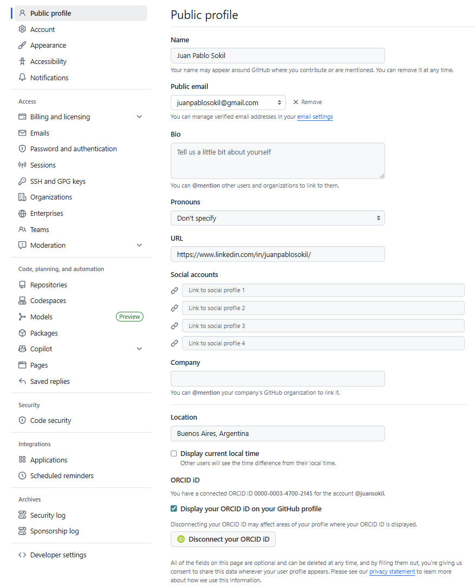

# Clase 01: Ingeniería de Datos — Data Pipelines - Arquitectura Medallion

> **Material de la clase**:
> - [`clase01.ipynb`](clase01.ipynb) — desarrollo teórico (Data Engineering, jerarquía del dato, modelado, pipelines, Arquitectura Medallion).
> - [`ejercicios/ejercicio.ipynb`](ejercicios/ejercicio.ipynb) — **el ejercicio entregable**: verifica tu setup de Git y genera tu `.txt` de registro en `ejercicios/estudiantes/` (ver [`ejercicios/README.md`](ejercicios/README.md)).
> - Este README — guía paso a paso de tu primer push con Git.

---

## 🎯 Objetivo de esta entrega

Realizar tu primer **push con Git** al repositorio de la materia: crear tu rama personal, registrar tus datos con el ejercicio y abrir tu primer Pull Request.

---

## ✅ Prerequisito

Tener **Git instalado** ([git-scm.com/downloads](https://git-scm.com/downloads)) y una **cuenta de GitHub**.

Si vas a abrir las notebooks en **VS Code**, instalá la extensión **Markdown Preview Mermaid Support** (`bierner.markdown-mermaid`): sin ella, los diagramas se ven como código. Cuando abrís el repo, VS Code te la ofrece solo.

---

## 🚀 Mi primer push con Git

**Paso 0 — Registro en el Onboarding**
1. Andá a [https://github-api-unsam-631093702231.southamerica-east1.run.app/unirse](https://github-api-unsam-631093702231.southamerica-east1.run.app/unirse)
2. Completá con tu Nombre, Email y **Usuario de GitHub**.
3. Código de clase: se les da durante la clase.
4. Revisá tu email y aceptá la invitación de GitHub.

> **Nota**: el repositorio es público (cualquiera lo puede ver), pero solo podés subir contenido (push) si aceptaste la invitación.

---

**Paso 1 — Cloná el repositorio**

> **Qué es "clonar"**: descargar a tu máquina toda la historia del repo (archivos + branches + tags). Es como "bajarse el repo entero". Solo lo hacés **una vez**.

Ubicate primero en una carpeta donde quieras tener el repo y ejecutá:
```bash
git clone https://github.com/juansokil/LCD-InfraCienciaDatos.git
cd LCD-InfraCienciaDatos
```

---

**Paso 2 — Creá tu rama personal** (nunca trabajamos directo en `main`)

> **Qué es una rama (branch)**: pensá a `main` como la versión oficial del curso. Tu rama personal (`estudiante/apellido-nombre`) es una copia paralela donde **vos** hacés tus entregas, sin afectar la oficial. Cada estudiante tiene su propia rama.

Creá tu rama personal (reemplazá `apellido-nombre` por el tuyo, ej: `estudiante/sokil-juan`):
```bash
git checkout -b estudiante/apellido-nombre
```

**Cómo se arma el nombre**: todo en minúsculas, sin tildes ni eñes, y **con un solo guión**, que separa el apellido del nombre. Si tenés **más de un nombre o más de un apellido, van pegados**:

| Estudiante | Rama |
| :--- | :--- |
| Juan Sokil | `estudiante/sokil-juan` |
| Juan Pablo Sokil | `estudiante/sokil-juanpablo` |
| María José García López | `estudiante/garcialopez-mariajose` |
| Tomás Del Río | `estudiante/delrio-tomas` |
| Ana Lucía D'Amato | `estudiante/damato-analucia` |

> **¿Por qué pegados?** Porque el guión es el separador entre apellido y nombre. Si escribieras `garcia-lopez-maria-jose`, no habría forma de saber dónde termina el apellido. Por eso la rama lleva **exactamente un guión** — y un robot de GitHub cierra automáticamente los PRs de ramas que no cumplen la convención (te avisa con un comentario y te dice cómo arreglarlo).

Verificá con `git branch` que el `*` esté al lado de tu rama nueva.

> **IMPORTANTE**: esta rama la vas a usar para **todas** las entregas del curso. No crees una rama nueva cada semana. El prefijo `estudiante/` la distingue de las ramas del docente.

> **¿Le erraste al nombre?** No pasa nada: el Paso 3 (notebook) calcula el nombre correcto a partir de tus datos y te da el comando exacto para renombrarla (`git branch -m ...`). Mientras no hayas pusheado, renombrar es gratis.

---

**Paso 3 — Hacé el ejercicio de entrega**

Abrí [`ejercicios/ejercicio.ipynb`](ejercicios/ejercicio.ipynb) desde Jupyter o VSCode. Completá tu nombre, apellido y usuario de GitHub (Paso 1 del notebook), ejecutá la verificación de Git (Paso 2) y generá tu archivo de entrega (Paso 3).

El script crea **un archivo único para vos** en `clase01/ejercicios/estudiantes/<apellido>-<nombre>.txt`.

> **Importante**: leé [`ejercicios/README.md`](ejercicios/README.md) — el deliverable es **solo el `.txt`**, no el notebook. Esto evita conflictos cuando muchos estudiantes suben al mismo tiempo.

---

**Paso 4 — Commit y push**

Reemplazá `<apellido>-<nombre>` por el filename que te imprimió el Paso 3 del notebook (ej: `sokil-juan.txt`). Desde la raíz del repo:

```bash
git add clase01/ejercicios/estudiantes/<apellido>-<nombre>.txt
git commit -m "ejercicio01: registro"
git push origin estudiante/apellido-nombre
```

> ⚠️ **No** uses `git add .` ni commitees el `.ipynb` modificado — es un template compartido entre todos los estudiantes.

> **Nota 1**: si es la primera vez que hacés `git commit`, configurá tu identidad para que tus commits queden bien identificados:
>
> ```bash
> git config --global user.name "Tu Nombre"
> git config --global user.email "tu@email.com"
> ```

> **Nota 2**: si es la primera vez que pusheás esta rama, Git puede pedir `git push --set-upstream origin estudiante/apellido-nombre`. Es normal, solo pasa la primera vez.

> **Nota 3**: si te pide password, en realidad se refiere al **PAT** (Personal Access Token) que tenés que generar desde GitHub:
> - GitHub → Settings → **Developer settings** (está abajo de todo, a la izquierda) → Personal access tokens → Tokens (classic).
>
>   
>
> - Generate new token → seleccioná al menos el scope `repo`.
> - Copiá el token (solo se muestra una vez).
>
>   

---

**Paso 5 — Abrí tu Pull Request** (una sola vez en todo el curso)

Este PR lo abrís **ahora** y lo dejás **abierto** todo el cuatrimestre: cada ejercicio siguiente vas a pushear a la misma rama y **este mismo PR se actualiza solo** (no abrís PRs nuevos).

1. Andá a [github.com/juansokil/LCD-InfraCienciaDatos](https://github.com/juansokil/LCD-InfraCienciaDatos).
2. Click en el botón **"Compare & pull request"** sobre tu rama `estudiante/apellido-nombre`.
3. Título: no te preocupes, el que sea. Apenas lo creás, el robot lo cambia por el nombre de tu rama (`estudiante/apellido-nombre`).
4. Creá el PR y **dejalo abierto**. El docente va a revisar tus entregas ahí, semana a semana.

**Qué vas a ver ahí de acá en adelante.** Apenas lo creás, un robot revisa el nombre de tu rama. Si está bien, no pasa nada y tu PR queda abierto. Si está mal, te deja un comentario con los comandos para arreglarlo y **cierra el PR** — no perdés nada: renombrás la rama y abrís uno nuevo. Es el único caso en que un PR del curso se cierra antes de tiempo, y si pasa, pasa acá.

Después, durante el cuatrimestre, el docente puede dejarte dos tipos de señal:

- 💬 un **comentario** — una observación o una pregunta; respondé en el mismo hilo.
- 🔴 **"Changes requested"** — rechazó una entrega y hay algo que corregir. **Tu PR sigue abierto**: corregís, `commit` + `push` a la misma rama, y ese push levanta la marca. No abras un PR nuevo.

> **Tu PR nunca se va a mergear, y eso no es una nota.** Es el diseño del curso: tu rama es tu espacio de trabajo y el PR es la ventana por donde se lo mira. Un PR abierto, con pushes semanales y sin marcas rojas, es exactamente lo que tiene que verse.

---

> **🔁 Cómo sigue el ciclo (importante)**
>
> Tu **rama** `estudiante/apellido-nombre` y tu **Pull Request** se crean **una sola vez acá** y los reusás todo el cuatrimestre — **nunca los borres**.
>
> En cada ejercicio siguiente **NO abrís un PR nuevo**. Solo:
> 1. Sincronizás tu rama con `main` para traer el material nuevo del curso: `git checkout main`, `git pull origin main`, `git checkout estudiante/apellido-nombre` y `git merge main --no-edit` (el detalle está al principio de cada clase y en el README raíz)
> 2. Hacés la entrega y la pusheás (`git push`)
>
> ...y tu PR (el que abriste acá) se actualiza solo. **Una rama para siempre, un PR para siempre.** El docente identifica cada entrega por el commit `ejercicioNN: ...` y el `.txt` nuevo. El detalle completo está en el [README raíz → "Cómo Consumir el Repo Semana a Semana"](../README.md).

> **Nota para el/la docente**: el PR del estudiante queda **abierto** todo el cuatrimestre y **nunca se mergea** (ni al final: al cierre del cuatrimestre se cierra sin mergear — la evaluación sale del PR y del historial de la rama, y `main` queda solo con el material oficial del curso). **NO** borres la rama `estudiante/apellido-nombre` — es la misma para todas las entregas.
