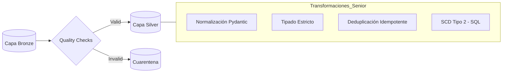
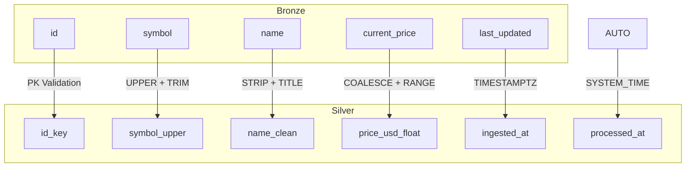

# Clase 04: La Refinería (Capa Silver)

> 📚 **Cómo está estructurada esta clase** (patrón compartido por clase03/04/05):
>
> 1. **Notebook teórico** ([`clase04.ipynb`](clase04.ipynb)) — conceptos + DAGs demo sobre datos sintéticos (`bronze.ventas_demo`)
> 2. **Ejercicio práctico** ([`ejercicios/ejercicio.ipynb`](ejercicios/ejercicio.ipynb)) — los mismos conceptos sobre CoinGecko (Bronze → Silver)
> 3. **DAG productivo** ([`ejercicios/dag_crypto_silver.py`](ejercicios/dag_crypto_silver.py)) — para copy-paste a Airflow

> **Material de la clase**:
> - [`clase04.ipynb`](clase04.ipynb) — desarrollo teórico + 2 DAGs pedagógicos progresivos (`dag_silver_basico.py`, `dag_silver_quarantine.py`) que se generan vía `%%writefile` al ejecutar el notebook.
> - [`ejercicios/ejercicio.ipynb`](ejercicios/ejercicio.ipynb) — ejercicio **opcional**: refinería de datos crypto (Bronze → Silver).
> - [`ejercicios/dag_crypto_silver.py`](ejercicios/dag_crypto_silver.py) — DAG productivo (con comentarios educativos), se copia al stack al final del ejercicio.

---

## 🎯 Objetivos

- Transformar datos crudos (**Capa Bronze**) en datos técnicos limpios (**Capa Silver**).
- Definir y validar **Contratos de Datos** profesionales (Data Quality).
- Implementar limpieza avanzada: normalización técnica y deductiva.
- Aplicar el patrón de **Cuarentena** para registros que no cumplen calidad.

---

## 🏗️ El Proceso de Refinería



## 🗺️ Linaje de Datos (Column-level)

A diferencia de Bronze donde traemos todo, en Silver refinamos campo a campo:



---

## 🚀 Setup

- Stack de la **Clase 02** corriendo (`docker compose up -d` desde `stack/`).
- Datos de Bronze ya cargados (los generaste en **Clase 03** corriendo el `dag_crypto_bronze.py`).
- Tu rama personal sincronizada (ver root README → "Cómo Consumir el Repo Semana a Semana").

---

## 📋 Cómo trabajar la clase

### Paso 1 — Leer el notebook teórico y correr los DAGs pedagógicos

Abrí `clase04.ipynb`. La primera parte explica conceptos (Contratos de Datos, Pydantic, SCD Tipo 2, Cuarentena). La parte final tiene **2 cells `%%writefile`** que generan DAGs progresivos sobre **datos sintéticos** — al ejecutarlos, los archivos `.py` aparecen automáticamente en `stack/dags/02-silver/`:

| DAG generado | Path destino | Qué introduce |
|--------------|--------------|---------------|
| `dag_silver_basico.py` | `stack/dags/02-silver/` | Limpieza básica: strip + Title Case + fillna + parser flexible de fechas |
| `dag_silver_quarantine.py` | `stack/dags/02-silver/` | Contrato Pydantic + Pattern Quarantine + Audit metadata |

Después de ejecutar las celdas, los DAGs aparecen en Airflow UI (`localhost:8080`). Activalos y verás los datos en `silver.ventas_demo` y `silver.quarantine_ventas_demo`.

### Paso 2 — (Opcional) Hacer el ejercicio práctico

Abrí `ejercicios/ejercicio.ipynb` para refinar tus propios datos crypto (Bronze → Silver). Es práctica personal sin entrega comprometida.

### Paso 3 — Deploy del DAG productivo crypto

Al final del ejercicio.ipynb encontrás un cell con el comando para deployar el DAG productivo:

```bash
cp clase04/ejercicios/dag_crypto_silver.py stack/dags/02-silver/
```

Airflow detecta el archivo automáticamente (refresh cada 10s). Activalo en la UI y mirá los datos en `silver.crypto_markets` y `silver.quarantine_crypto_markets`.

---

## 🏆 Desafío Senior

No te conformes con `replace`. El objetivo es implementar una carga **idempotente** usando SQL nativo (`ON CONFLICT` o `MERGE`), asegurando que tu pipeline pueda fallar y recuperarse sin generar duplicados.

---

## 🛠️ Troubleshooting

| Problema | Solución |
| :--- | :--- |
| El DAG no aparece en Airflow UI | Verificar que el archivo esté en `stack/dags/02-silver/`. Esperar 10-30s para que Airflow lo detecte. |
| `ImportError: pydantic` (en el DAG silver) | El módulo viene en el Dockerfile del stack. Si falla, rebuild: `docker compose down && docker compose up -d --build`. |
| El DAG corre pero `silver.crypto_markets` está vacío | Verificá que el DAG `crypto_bronze` (clase03) haya corrido antes y poblado `bronze.crypto_markets`. |
| Muchos registros van a quarantine | Mirá la tabla `silver.quarantine_crypto_markets` — el campo `quarantine_reason` te dice por qué fueron rechazados. |
