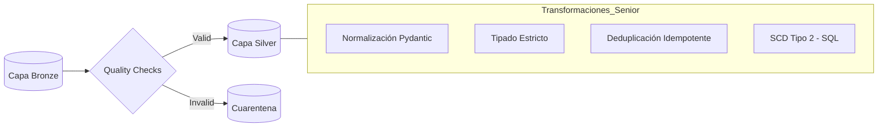
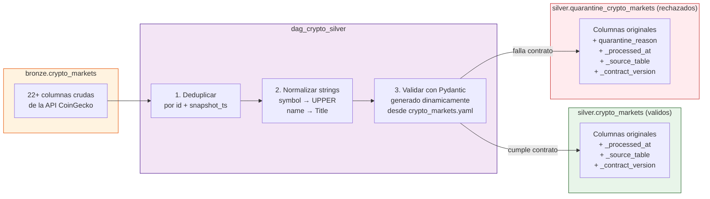

# Clase 04: La Refinería (Capa Silver)

> 📚 **Cómo está estructurada esta clase** (patrón compartido por clase03/04/05):
>
> 1. **Notebook teórico** ([`clase04.ipynb`](clase04.ipynb)) — conceptos + DAGs demo sobre datos sintéticos (`bronze.ventas_demo`)
> 2. **Ejercicio práctico** ([`ejercicios/ejercicio.ipynb`](ejercicios/ejercicio.ipynb)) — los mismos conceptos sobre CoinGecko (Bronze → Silver)
> 3. **DAG productivo** ([`ejercicios/dag_crypto_silver.py`](ejercicios/dag_crypto_silver.py)) — para copy-paste a Airflow

> **Material de la clase**:
> - [`clase04.ipynb`](clase04.ipynb) — desarrollo teórico + 2 DAGs pedagógicos progresivos (`silver_01_basico.py`, `silver_02_quarantine.py`) que se generan vía `%%writefile` al ejecutar el notebook.
> - [`ejercicios/ejercicio.ipynb`](ejercicios/ejercicio.ipynb) — ejercicio **opcional**: refinería de datos crypto (Bronze → Silver).
> - [`ejercicios/dag_crypto_silver.py`](ejercicios/dag_crypto_silver.py) — DAG productivo (con comentarios educativos), se copia al stack al final del ejercicio.
> - [`anexo_sql/`](anexo_sql/) — anexo **opcional** con 11 ejercicios de SQL graduados (SELECT → JOIN → GROUP BY → subqueries → window functions) sobre la base **Northwind**, conectando cada técnica con un patrón real de Silver.

---

## 🎯 Objetivos

- Transformar datos crudos (**Capa Bronze**) en datos técnicos limpios (**Capa Silver**).
- Definir y validar **Contratos de Datos** profesionales (Data Quality).
- Implementar limpieza avanzada: normalización técnica y deductiva.
- Aplicar el patrón de **Cuarentena** para registros que no cumplen calidad.

---

## 🏗️ El Proceso de Refinería



## 🗺️ Linaje de Datos (Bronze → Silver)

A diferencia de Bronze donde traemos todo crudo, en Silver pasa por 3 transformaciones antes de llegar a la tabla final. El DAG productivo `dag_crypto_silver` separa válidos de inválidos sin descartar nada:



> **Nota**: el lineage NO renombra columnas (no hay `id_key`, `symbol_upper`, etc. — los nombres se mantienen). Lo que cambia es el **contenido** (normalizado) y la **garantía de validez** (Pydantic ya las chequeó).

---

## 🚀 Setup

- Stack de la **Clase 02** corriendo (`docker compose up -d` desde `stack/`).
- Datos de Bronze ya cargados (los generaste en **Clase 03** corriendo el `dag_crypto_bronze.py`).
- Tu rama personal sincronizada (ver root README → "Cómo Consumir el Repo Semana a Semana").

---

## 📋 Cómo trabajar la clase

### Paso 1 — Leer el notebook teórico y correr los DAGs pedagógicos

Abrí `clase04.ipynb`. La primera parte explica conceptos (Contratos de Datos, Pydantic, SCD Tipo 2, Cuarentena). La parte final tiene cells `%%writefile` que generan **2 DAGs sintéticos numerados** — al ejecutarlos, los `.py` aparecen automáticamente en `stack/dags/02-silver/`:

| # | DAG generado | Path destino | Qué aporta |
|---|--------------|--------------|------------|
| 01 | `silver_01_basico.py` | `stack/dags/02-silver/` | Limpieza básica: strip + Title Case + fillna + parser flexible de fechas |
| 02 | `silver_02_quarantine.py` | `stack/dags/02-silver/` | Contrato Pydantic generado dinámicamente desde `ventas.yaml` + Pattern Quarantine + Audit metadata |

Después de ejecutar las celdas, los DAGs aparecen en Airflow UI (`localhost:8080`). En la UI, filtrá por **tag `silver`** para verlos juntos. Activalos y verás los datos en `silver.ventas_demo` y `silver.quarantine_ventas_demo`.

> **Convención de carpetas**: cada DAG vive en la carpeta de su **capa Medallion destino** (`02-silver/` para todo lo que escribe a `silver.*`). Mismo patrón que `01-bronze/` en clase 03.
>
> **Convención de tags**: sintéticos didácticos llevan `tags=["silver"]`. El DAG productivo (crypto) lleva `tags=["prod", "silver", "crypto"]` para distinguirlo en la UI con el filtro `prod`.
>
> **🔁 Continuidad con clase 03**: el `silver_02_quarantine` lee el **mismo `ventas.yaml`** que usaba `bronze_04_con_contrato`. Bronze validaba la *forma*, Silver valida la *semántica*. Un contrato, dos capas.

### Paso 2 — (Opcional) Hacer el ejercicio práctico

Abrí `ejercicios/ejercicio.ipynb` para refinar tus propios datos crypto (Bronze → Silver). Es práctica personal sin entrega comprometida.

### Paso 3 — Deploy del DAG productivo crypto

Al final del ejercicio.ipynb encontrás un cell con el comando para deployar el DAG productivo:

```bash
cp clase04/ejercicios/dag_crypto_silver.py stack/dags/02-silver/
```

Airflow detecta el archivo automáticamente (refresh cada 10s). Activalo en la UI y mirá los datos en `silver.crypto_markets` y `silver.quarantine_crypto_markets`.

> Filtrá por tag **`prod`** en la UI para ver solo los DAGs productivos (separa el DAG real del crypto de la escalera didáctica `silver_01_*` → `silver_02_*`).
>
> El DAG productivo aplica el **mismo patrón data contract** que `dag_crypto_bronze` — carga `crypto_markets.yaml`, construye `CryptoContract` con `build_pydantic_from_contract()` en runtime y separa filas válidas de inválidas (con `quarantine_reason` por fila). Para verlo en acción: en los logs de la task `clean_and_split` aparece `Contrato cargado: crypto_markets v1.0`.

### ⚠️ Si modificás el DAG productivo

Si tocás `clase04/ejercicios/dag_crypto_silver.py`, **acordate de re-copiar** al stack — sino Airflow corre la versión vieja:

```bash
cp clase04/ejercicios/dag_crypto_silver.py stack/dags/02-silver/
```

---

## 🏆 Desafío Senior

No te conformes con `replace`. El objetivo es implementar una carga **idempotente** usando SQL nativo (`ON CONFLICT` o `MERGE`), asegurando que tu pipeline pueda fallar y recuperarse sin generar duplicados.

---

## 📚 Anexo SQL (opcional, ~1-2 horas)

Si las queries del ejercicio crypto te resultan difíciles, **andá al anexo antes de seguir**. Es un mini-curso de SQL aplicado a Data Quality usando la base **Northwind**:

| Aspecto | Detalle |
|---|---|
| **¿Cuándo conviene hacerlo?** | Si te tropezás con `JOIN`, `GROUP BY`, `ROW_NUMBER` en el ejercicio crypto. O si querés refrescar SQL antes de Silver/Gold. |
| **¿Qué obtengo?** | Fluidez en SQL aplicado a Data Quality: filtros, deduplicación, integridad referencial, outliers, dedup SCD2 con window functions. |
| **¿Cuánto tarda?** | 1-2 horas. Está graduado en 4 bloques (E1-E2 SELECT/WHERE → E3-E5 GROUP BY → E6-E8 JOINs → E9-E11 Subqueries+CASE+Window). Podés cortar a la mitad y volver. |
| **¿Dónde corre?** | Postgres (si tenés el stack levantado) **o** DuckDB (si trabajás offline). El setup detecta auto cuál usar. |
| **¿Qué obtengo de bonus?** | Una mini-sección al final del notebook que te muestra cómo **dbt** hace todo esto en YAML — la herramienta estándar de la industria. |

📖 **Detalle completo**: [`anexo_sql/README.md`](anexo_sql/README.md)

> Cada ejercicio incluye una nota **🔗 En Silver esto sería...** que conecta la técnica SQL con un caso real de la clase. No es SQL desconectado: es la herramienta concreta para construir Silver.

---

## ✅ Verificación end-to-end

Después de correr el pipeline Silver completo (DAG `crypto_silver` activado y triggered), deberías poder responder estas 3 queries:

```sql
-- 1. ¿Hay datos en silver?
SELECT COUNT(*) AS validos FROM silver.crypto_markets;
-- Esperado: > 0 (~50 filas por snapshot)

-- 2. ¿Cuántos fueron a quarantine y por qué?
SELECT quarantine_reason, COUNT(*) AS cantidad
FROM silver.quarantine_crypto_markets
GROUP BY 1
ORDER BY 2 DESC;
-- Esperado: pocos rechazos, motivos claros (ValidationError de Pydantic)

-- 3. ¿La tasa de éxito es razonable?
SELECT
  (SELECT COUNT(*) FROM silver.crypto_markets) AS validos,
  (SELECT COUNT(*) FROM silver.quarantine_crypto_markets) AS rechazados,
  ROUND(
    (SELECT COUNT(*) FROM silver.crypto_markets) * 100.0 /
    NULLIF((SELECT COUNT(*) FROM silver.crypto_markets) +
           (SELECT COUNT(*) FROM silver.quarantine_crypto_markets), 0),
    2
  ) AS tasa_exito_pct;
-- Esperado: tasa > 95% en datos crypto reales
```

Si las 3 queries devuelven valores razonables, tu pipeline Silver está **funcional + observable + auditable**.

---

## 🔮 Forward reference a Gold (clase 05)

Hasta acá tenemos `silver.crypto_markets` con datos limpios y validados (Pydantic + quarantine + audit metadata). En **clase 05** vamos a:

| Concepto | Qué construimos |
|---|---|
| **Star Schema** | Separar **dimensiones** (`dim_crypto`, `dim_tiempo`) de **hechos** (`fact_market_snapshot`). Modelado dimensional clásico de Kimball. |
| **ABT (Analytical Base Table)** | Tabla ancha con features derivadas (avg_price, volatility_category, market_cap_tier) lista para alimentar modelos de ML. |
| **SCD Tipo 2** | Historizar cambios en `dim_crypto` usando los campos del bloque `scd:` del YAML del contrato (`business_key`, `tracked_columns`, `effective_date`). Mismo contrato, otra capa. |
| **Integridad referencial** | Validar FKs antes de publicar a BI/ML — detectar fact rows huérfanos sin dimensión. |

> 🔁 **El círculo se cierra**: el `crypto_markets.yaml` que validó forma en Bronze (clase 03) y semántica en Silver (clase 04), ahora alimenta el modelado dimensional en Gold (clase 05). Un contrato, **tres capas**, tres responsabilidades.

---

## 🛠️ Troubleshooting

| Problema | Solución |
| :--- | :--- |
| El DAG no aparece en Airflow UI | Verificar que el archivo esté en `stack/dags/02-silver/`. Esperar 10-30s para que Airflow lo detecte. |
| `ImportError: pydantic` (en el DAG silver) | El módulo viene en el Dockerfile del stack. Si falla, rebuild: `docker compose down && docker compose up -d --build`. |
| El DAG corre pero `silver.crypto_markets` está vacío | Verificá que el DAG `crypto_bronze` (clase03) haya corrido antes y poblado `bronze.crypto_markets`. |
| Muchos registros van a quarantine | Mirá la tabla `silver.quarantine_crypto_markets` — el campo `quarantine_reason` te dice por qué fueron rechazados. |
| El DAG productivo no aplica el contract refactorizado | La copia en `stack/dags/02-silver/dag_crypto_silver.py` quedó desactualizada. Re-copiá: `cp clase04/ejercicios/dag_crypto_silver.py stack/dags/02-silver/` |
