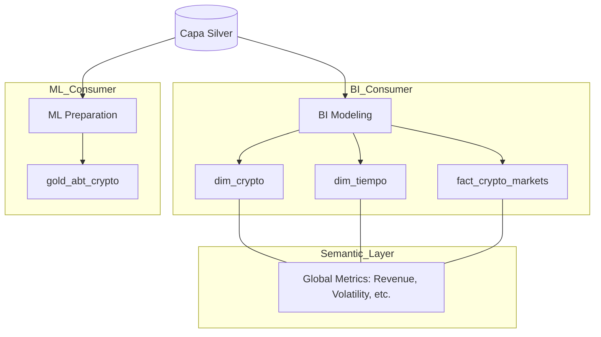
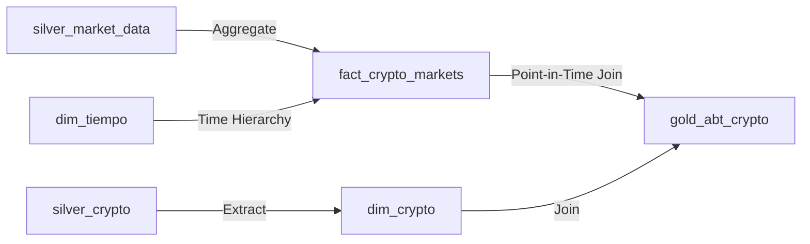

# Clase 05: La Bóveda (Capa Gold)

> 📚 **Cómo está estructurada esta clase** (patrón compartido por clase03/04/05):
>
> 1. **Notebook teórico** ([`clase05.ipynb`](clase05.ipynb)) — conceptos + DAGs demo + página dashboard sobre datos sintéticos (`silver.ventas_demo`)
> 2. **Ejercicio práctico** ([`ejercicios/ejercicio.ipynb`](ejercicios/ejercicio.ipynb)) — los mismos conceptos sobre CoinGecko (Silver → Gold)
> 3. **DAG productivo** ([`ejercicios/dag_crypto_gold.py`](ejercicios/dag_crypto_gold.py)) — para copy-paste a Airflow

> **Material de la clase**:
> - [`clase05.ipynb`](clase05.ipynb) — desarrollo teórico + 2 DAGs pedagógicos progresivos (`dag_gold_star_basico.py`, `dag_gold_abt.py`) + 1 página de dashboard demo (`7_Demo_Pedagogico.py`), todo generado vía `%%writefile` al ejecutar el notebook.
> - [`ejercicios/ejercicio.ipynb`](ejercicios/ejercicio.ipynb) — ejercicio **opcional**: construcción manual de Hechos y Dimensiones sobre datos crypto.
> - [`ejercicios/dag_crypto_gold.py`](ejercicios/dag_crypto_gold.py) — DAG productivo, se copia al stack al final del ejercicio.

---

## 🎯 Objetivos

- Modelar datos para negocio usando el **Star Schema** (Hechos y Dimensiones).
- Construir tablas **ABT (Analytical Base Tables)** optimizadas para Machine Learning.
- Comprender la importancia de la **Capa Semántica** y las métricas gobernadas.
- Asegurar la **integridad referencial** total en la capa final.

---

## 🏗️ Arquitectura de la Capa Gold



## 🗺️ Linaje de Datos (Gold)

En Gold, los datos se denormalizan para facilitar el consumo:



---

## 🚀 Setup

- Stack de la **Clase 02** corriendo (`docker compose up -d` desde `stack/`).
- Datos de Silver ya cargados (los generaste en **Clase 04** corriendo el `dag_crypto_silver.py`).
- Tu rama personal sincronizada (ver root README → "Cómo Consumir el Repo Semana a Semana").

---

## 📋 Cómo trabajar la clase

### Paso 1 — Leer el notebook teórico y correr los DAGs pedagógicos

Abrí `clase05.ipynb`. La primera parte explica conceptos (Star Schema, Capa Semántica, ABT, Best Practices). La parte final tiene **3 cells `%%writefile`** que generan dos DAGs pedagógicos y una página de dashboard sobre **datos sintéticos**:

| Archivo generado | Path destino | Qué introduce |
|---|---|---|
| `dag_gold_star_basico.py` | `stack/dags/03-gold/` | Star Schema básico: `dim_producto` + `dim_tiempo` + `fact_ventas` con FKs |
| `dag_gold_abt.py` | `stack/dags/03-gold/` | ABT (wide table) para ML: features derivadas + segmentación con `pd.cut` |
| `7_Demo_Pedagogico.py` | `stack/dashboard/pages/` | Página Streamlit que visualiza el Star Schema + ABT generado |

Después de correr las celdas, los DAGs aparecen en Airflow UI (`localhost:8080`) y la página nueva en Streamlit (`localhost:8501`).

### Paso 2 — (Opcional) Hacer el ejercicio práctico

Abrí `ejercicios/ejercicio.ipynb` para construir manualmente Hechos y Dimensiones sobre datos crypto reales. Es práctica personal sin entrega comprometida.

### Paso 3 — Deploy del DAG productivo crypto

Al final del ejercicio.ipynb encontrás el cell con el comando para deployar el DAG productivo:

```bash
cp clase05/ejercicios/dag_crypto_gold.py stack/dags/03-gold/
```

Airflow lo detecta. Activalo en la UI y vas a ver `gold.dim_crypto`, `gold.dim_tiempo`, `gold.fact_crypto_markets`, `gold.fact_global_market` y `gold.gold_abt_crypto` poblándose con datos reales.

---

## 🎨 Dashboard incluido en el stack

El stack levanta automáticamente un **dashboard de Streamlit** (`http://localhost:8501`) desde la **Clase 02**. Hasta ahora estaba esperando que tuvieras tablas Gold para mostrar — ahora que las tenés, este es su momento.

El dashboard ya tiene **6 páginas pre-construidas** que leen tus tablas automáticamente:

| Página | Qué muestra | Lee de |
|--------|-------------|--------|
| **Bronze** | Datos crudos por cada tabla ingestada | `bronze.*` |
| **Silver** | Datos limpios + tabla de cuarentena | `silver.*` |
| **📊 Gold — Resumen Mercado** | KPIs globales del mercado crypto | `gold.fact_global_market` |
| **🏆 Gold — Ranking Precios** | Top criptos por valor / volumen / market cap | `gold.dim_crypto` + `gold.fact_crypto_markets` |
| **📉 Gold — Volatilidad / Riesgo** | Métricas de volatilidad histórica | `gold.fact_crypto_markets` |
| **🥧 Gold — Dominancia** | Share de mercado de las top criptos | `gold.fact_global_market` |

### Página demo generada por el notebook

El notebook teórico genera vía `%%writefile` una **séptima página** (`7_Demo_Pedagogico.py`) que conecta directo con las tablas que crean los DAGs pedagógicos (`gold.dim_producto`, `gold.dim_tiempo`, `gold.fact_ventas`, `gold.abt_clientes`). Streamlit la detecta automáticamente — refrescá `localhost:8501` y aparece en el menú lateral.

### ¿Querés agregar tu propia visualización?

Streamlit detecta automáticamente cualquier archivo `.py` que pongas en `stack/dashboard/pages/`. Usá la página demo como referencia y crea la tuya:

```bash
# Copiá la demo como punto de partida
cp stack/dashboard/pages/7_Demo_Pedagogico.py stack/dashboard/pages/8_Mi_Custom.py
# Editala y refrescá Streamlit — sin rebuild necesario
```

> **Preview de Clase 06 (Workshop End-to-End)**: vas a extender este dashboard agregando tu propia página custom. El dashboard pasa de "caja negra" a "código que vos modificás".

---

## 🏆 Desafío Senior: Integrity Guard

Tu entregable no está listo hasta que pase la auditoría. Implementá un **Integrity Guard** que verifique automáticamente que no haya registros huérfanos entre tus fact tables y dimensiones, garantizando una base sólida para cualquier reporte de BI.

---

## 🛠️ Troubleshooting

| Problema | Solución |
| :--- | :--- |
| El DAG no aparece en Airflow UI | Verificar que el archivo esté en `stack/dags/03-gold/`. Esperar 10-30s para que Airflow lo detecte. |
| El DAG corre pero las tablas Gold están vacías | Verificá que `crypto_silver` (clase04) haya corrido antes y poblado `silver.crypto_markets`. |
| `IntegrityError: foreign key violation` | El DAG verifica integridad. Mirá la tabla `dim_crypto` — todos los `crypto_id` de `fact_crypto_markets` tienen que existir en `dim_crypto`. |
