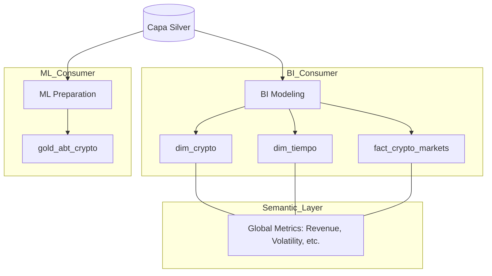
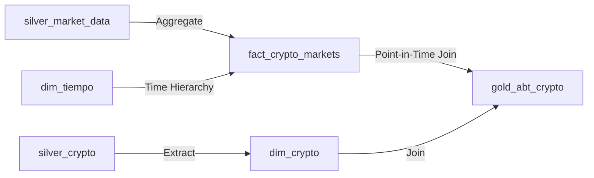

# Clase 05: La Bóveda (Capa Gold)

> 📚 **Cómo está estructurada esta clase** (patrón compartido por clase03/04/05):
>
> 1. **Notebook teórico** ([`clase05.ipynb`](clase05.ipynb)) — conceptos + DAGs demo + página dashboard sobre datos sintéticos (`silver.ventas_demo`)
> 2. **Ejercicio práctico (con entrega)** ([`ejercicios/ejercicio.ipynb`](ejercicios/ejercicio.ipynb)) — 8 ejercicios de **SQL Gold** sobre **Northwind** (agregaciones, JOIN *star*, CASE, ranking)
> 3. **DAG productivo** ([`ejercicios/dag_crypto_gold.py`](ejercicios/dag_crypto_gold.py)) — para copy-paste a Airflow

> **Material de la clase**:
> - [`clase05.ipynb`](clase05.ipynb) — desarrollo teórico + 2 DAGs pedagógicos progresivos (`gold_01_star_basico.py`, `gold_02_abt.py`) + las 5 páginas del dashboard Gold (`1_`–`4_Gold_*.py` productivas + `5_Gold_Demo_Ventas.py` demo), todo generado vía `%%writefile` al ejecutar el notebook.
> - [`ejercicios/ejercicio.ipynb`](ejercicios/ejercicio.ipynb) — **el ejercicio entregable**, un solo archivo autocontenido: **Parte 1** carga **Northwind** (dual-engine Postgres/DuckDB) y **Parte 2** son **8 ejercicios de SQL Gold** (GROUP BY+agregaciones, HAVING, JOIN tipo *star*, CASE buckets, ROW_NUMBER/RANK, % del total). La **📦 Entrega** se deriva ejecutando tus queries (sin autoreporte) → `.txt` en `ejercicios/alumnos/` (ver [`ejercicios/README.md`](ejercicios/README.md)).
> - [`ejercicios/dag_crypto_gold.py`](ejercicios/dag_crypto_gold.py) — DAG productivo, se copia al stack al final del ejercicio.

---

## 🔁 Continuidad con clase 04

En **clase 04** cargamos `silver.crypto_markets` con datos limpios validados contra el contrato `crypto_markets.yaml`, más una tabla `silver.quarantine_*` para los registros que fallaron Pydantic. En **Gold** consumimos `silver.crypto_markets` (NO `bronze.*`) y la transformamos en un modelo dimensional listo para BI (`dim_*` + `fact_*`) + una **ABT** lista para ML.

> **Decisión arquitectural** (excepción documentada): `fact_global_market` lee de `bronze.global_market` **directo**, salteándose Silver. Razón: el dato macro ya viene agregado por la API de CoinGecko (no son filas individuales que validar) y Silver no agrega valor. Está documentado en [`ejercicios/dag_crypto_gold.py`](ejercicios/dag_crypto_gold.py).

---

## 🎯 Objetivos

- Modelar datos para negocio usando el **Star Schema** (Hechos y Dimensiones).
- Construir tablas **ABT (Analytical Base Tables)** optimizadas para Machine Learning.
- Comprender la importancia de la **Capa Semántica** y las métricas gobernadas.
- Asegurar la **integridad referencial** total en la capa final.

---

## 🏗️ Arquitectura de la Capa Gold



## 🗺️ Linaje de Datos (Gold)

En Gold, los datos se denormalizan para facilitar el consumo:



---

## 🚀 Setup

- Stack de la **Clase 02** corriendo (`docker compose up -d` desde `stack/`).
- Datos de Silver ya cargados (los generaste en **Clase 04** corriendo el `dag_crypto_silver.py`).
- Tu rama personal sincronizada (ver root README → "Cómo Consumir el Repo Semana a Semana").

---

## 📋 Cómo trabajar la clase

### Paso 1 — Leer el notebook teórico y correr los DAGs pedagógicos

Abrí `clase05.ipynb`. La primera parte explica conceptos (Star Schema, Capa Semántica, ABT, Best Practices). La parte final tiene **7 cells `%%writefile`** que generan 2 DAGs pedagógicos (datos sintéticos) y las **5 páginas del dashboard Gold** (4 productivas + 1 demo):

| # | Archivo generado | Path destino | Qué introduce |
|---|---|---|---|
| 01 | `gold_01_star_basico.py` | `stack/dags/03-gold/` | Star Schema básico: `dim_producto_demo` + `dim_tiempo_demo` + `fact_ventas_demo` con FKs |
| 02 | `gold_02_abt.py` | `stack/dags/03-gold/` | ABT (wide table) para ML: features derivadas + segmentación con `pd.cut` |
| — | `1_`–`4_Gold_*.py` | `stack/dashboard/pages/` | 4 páginas Gold del dashboard sobre datos **productivos** de `crypto_gold` |
| — | `5_Gold_Demo_Ventas.py` | `stack/dashboard/pages/` | Página demo: Star Schema + ABT sobre datos **sintéticos** de ventas |

Después de correr las celdas, los DAGs aparecen en Airflow UI (`localhost:8080`) — filtrá por tag **`gold`** para verlos juntos — y las 5 páginas del dashboard en Streamlit (`localhost:8501`).

> **Convenciones aplicadas** (consistente con clase03/04):
> - **Carpeta**: cada DAG vive en la capa Medallion destino (`03-gold/` para todo lo que escribe a `gold.*`).
> - **Tags**: sintéticos didácticos llevan `tags=["gold"]`. El productivo crypto lleva `tags=["prod", "gold", "crypto"]` — filtrá por `prod` en la UI para verlo separado de los didácticos.
> - **Numeración**: `gold_NN_xxx.py` con prefijo letra (igual que `bronze_NN_xxx.py` y `silver_NN_xxx.py`). Evita el bug histórico de Airflow con archivos que arrancan con dígito. Las páginas Streamlit (`1_`–`5_*.py`) SÍ arrancan con dígito porque es la **convención de orden de Streamlit**, no Airflow.

### Paso 2 — Hacer el ejercicio práctico (con entrega)

Abrí `ejercicios/ejercicio.ipynb` (un solo archivo): corré la **Parte 1 — Setup** (carga Northwind, dual-engine Postgres/DuckDB) y resolvé los **8 ejercicios de SQL Gold** de la **Parte 2** (agregaciones que **colapsan el grano** para responder preguntas de negocio — el inverso de Silver en clase 04). Al final, la sección **📦 Entrega** **ejecuta tus `query_g1..query_g8`** y genera automáticamente `ejercicios/alumnos/<apellido>-<nombre>.txt` (motor + evidencia de Northwind + cuántos ejercicios devolvieron resultado, extraído de tus queries, **no autoreportado**) y te indica cómo subirlo (commit + push + **PR nuevo** de esta clase). Reglas completas en [`ejercicios/README.md`](ejercicios/README.md).

> **Una rama para siempre, un PR por clase**: tu rama `apellido-nombre` es la misma desde clase01; el PR es nuevo cada clase (el anterior ya se mergeó). Detalle en el [README raíz](../README.md).

### Paso 3 — Deploy del DAG productivo crypto

El DAG productivo de Gold (ahora **SQL ELT**, ver su header) se deploya copiándolo al stack — Airflow lo detecta solo:

```bash
cp clase05/ejercicios/dag_crypto_gold.py stack/dags/03-gold/
```

Airflow lo detecta. Activalo en la UI y vas a ver `gold.dim_crypto`, `gold.dim_tiempo`, `gold.fact_crypto_markets`, `gold.fact_global_market` y `gold.gold_abt_crypto` poblándose con datos reales.

---

## 🎨 Dashboard incluido en el stack

El stack levanta un **dashboard de Streamlit** (`http://localhost:8501`) desde la **Clase 02**, pero las páginas Gold **se generan al ejecutar `clase05.ipynb`** (celdas `%%writefile`): quedan documentadas y reproducibles desde el notebook, no shippeadas como archivos estáticos.

Al correr el notebook se escriben **5 páginas** en `stack/dashboard/pages/`:

| # · Página | Qué muestra | Lee de |
|--------|-------------|--------|
| **1 · 📊 Gold — Resumen Mercado** | KPIs globales del mercado crypto | `gold.fact_global_market` |
| **2 · 🏆 Gold — Ranking Precios** | Top criptos por valor / volumen / market cap | `gold.dim_crypto` + `gold.fact_crypto_markets` |
| **3 · 📉 Gold — Volatilidad / Riesgo** | Métricas de volatilidad histórica | `gold.fact_crypto_markets` |
| **4 · 🥧 Gold — Dominancia** | Share de mercado de las top criptos | `gold.fact_global_market` |
| **5 · 🎓 Gold — Demo Ventas** | Star Schema + ABT sobre datos **sintéticos** | `gold.*_demo` (DAGs `gold_0*`) |

Las páginas **1–4** leen las tablas **productivas** de `crypto_gold`; la **5** (demo) lee las `*_demo` de los DAGs pedagógicos. Streamlit las detecta automáticamente — refrescá `localhost:8501`.

### ¿Querés agregar tu propia visualización?

Streamlit detecta automáticamente cualquier archivo `.py` que pongas en `stack/dashboard/pages/`. Usá la página demo como referencia y crea la tuya:

```bash
# Copiá la demo como punto de partida
cp stack/dashboard/pages/5_Gold_Demo_Ventas.py stack/dashboard/pages/6_Mi_Custom.py
# Editala y refrescá Streamlit — sin rebuild necesario
```

---

## ✅ Verificación end-to-end

Después de correr `gold_01_star_basico` + `gold_02_abt` (sintéticos) + `dag_crypto_gold` (productivo), deberías poder responder estas 3 queries:

```sql
-- 1. ¿Las 5 tablas Gold productivas tienen datos?
SELECT 'dim_crypto'           AS tabla, COUNT(*) AS filas FROM gold.dim_crypto
UNION ALL
SELECT 'dim_tiempo',           COUNT(*) FROM gold.dim_tiempo
UNION ALL
SELECT 'fact_crypto_markets',  COUNT(*) FROM gold.fact_crypto_markets
UNION ALL
SELECT 'fact_global_market',   COUNT(*) FROM gold.fact_global_market
UNION ALL
SELECT 'gold_abt_crypto',      COUNT(*) FROM gold.gold_abt_crypto;
-- Esperado: las 5 con filas > 0

-- 2. Integridad referencial: ¿hay registros huérfanos en fact_crypto_markets?
SELECT COUNT(*) AS huerfanos
FROM gold.fact_crypto_markets f
LEFT JOIN gold.dim_crypto d ON f.crypto_id = d.crypto_id
WHERE d.crypto_id IS NULL;
-- Esperado: 0

-- 3. ¿La ABT tiene todas las features?
SELECT column_name
FROM information_schema.columns
WHERE table_schema = 'gold' AND table_name = 'gold_abt_crypto'
ORDER BY ordinal_position;
-- Esperado: ~20 features (id, symbol, price, market_cap, volatility, supply_ratio, ath_distance, ...)
```

Si las 3 queries devuelven valores razonables, tu pipeline Gold está **funcional + íntegro + listo para consumo BI/ML**.

---

## 🔮 Forward reference a clase 06 (Workshop End-to-End)

**Clase 06** es la **clase de cierre del cuatrimestre** — workshop magistral, sin entrega comprometida. El objetivo es **consolidar lo aprendido y ver el cuadro completo**. Lo que vas a ver:

- **Recap del cuatrimestre**: tabla + diagrama Mermaid del pipeline completo (Bronze→Silver→Gold→ML) + decisiones técnicas clave de cada capa + errores típicos / lecciones aprendidas.
- **Workshop ML sobre la ABT**: clasificación honesta de la **dirección de precio 24h** (`subio_24h`) desde *fundamentals* con **baseline + un model zoo de 4 modelos** (regresión logística, árbol, random forest, gradient boosting) + feature importance, sobre `gold.gold_abt_crypto`. Incluye una **lección sobre target leakage**.
- **Tracking con MLflow**: registrar runs (params + metrics + modelos), comparar los runs del model zoo entre sí, ver la UI en `localhost:5000`.
- **Monitoring E2E del pipeline**: tres niveles de observabilidad (infra / datos / negocio), dashboard Streamlit como cierre del ciclo, health check SQL del pipeline completo.
- **Orquestación E2E**: un Master DAG (`crypto_pipeline_e2e`) dispara Bronze→Silver→Gold en cascada con `TriggerDagRunOperator`. **Caveat pedagógico explícito**: es el patrón más simple para *enseñar* orquestación entre DAGs; en producción real con frecuencias distintas se usa **Airflow Datasets** (data-aware scheduling) o **decoupling por idempotencia**. La clase explica las 3 alternativas con tabla comparativa.
- **Bonus Track MLOps**: mapa de Feature Stores, Model Registry, Drift Detection, Training-Serving Skew. No se enseña — es la próxima frontera.

> 🔁 **El círculo Medallion se cierra**: el contrato YAML que validó la **forma** del archivo en Bronze (clase03) y la **semántica** de cada fila en Silver (clase04) culmina en Gold con la **integridad referencial** del modelo dimensional (clase05). En clase06 consumimos ese output para entrenar ML productivo + ver el cuadro completo. **Un solo contrato, cuatro capas, cuatro responsabilidades**.

---

## 🛠️ Troubleshooting

| Problema | Solución |
| :--- | :--- |
| El DAG no aparece en Airflow UI | Verificar que el archivo esté en `stack/dags/03-gold/`. Esperar 10-30s para que Airflow lo detecte. |
| El DAG corre pero las tablas Gold están vacías | Verificá que `crypto_silver` (clase04) haya corrido antes y poblado `silver.crypto_markets`. |
| `IntegrityError: foreign key violation` | El DAG verifica integridad. Mirá la tabla `dim_crypto` — todos los `crypto_id` de `fact_crypto_markets` tienen que existir en `dim_crypto`. |
