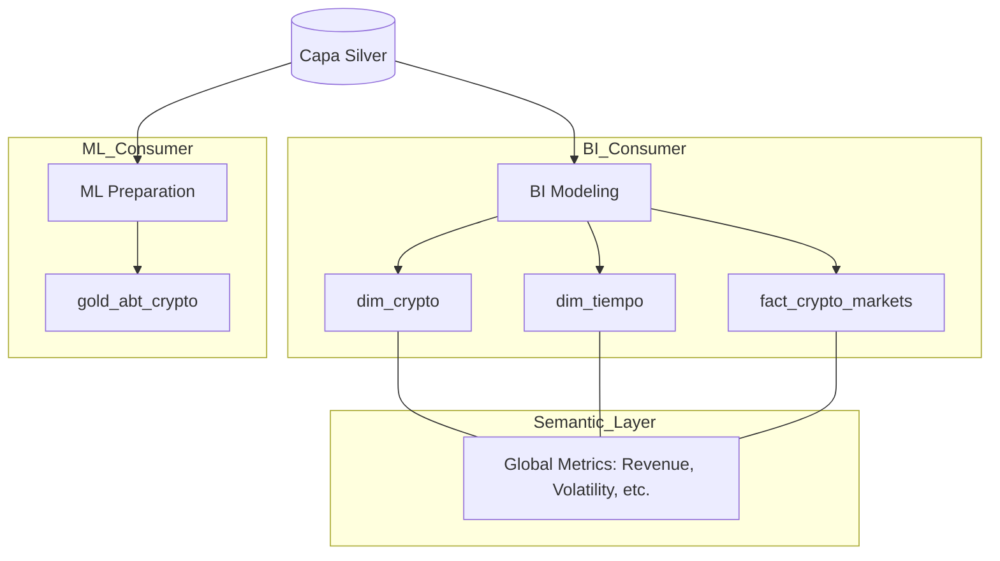
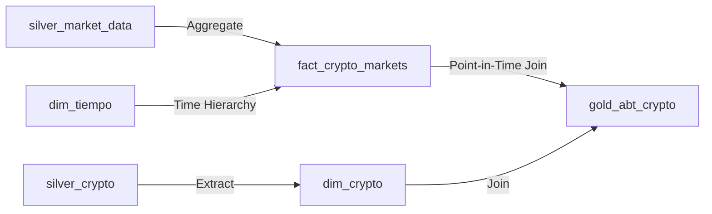

# Clase 05: La Bóveda (Capa Gold)

> **Material de la clase**:
> - [`clase05.ipynb`](clase05.ipynb) — desarrollo teórico: Star Schema, Capa Semántica, Wide Tables (ABT), Best Practices Gold.
> - [`ejercicios/ejercicio.ipynb`](ejercicios/ejercicio.ipynb) — ejercicio **opcional**: construcción manual de Hechos y Dimensiones.
> - [`ejercicios/dag_crypto_gold.py`](ejercicios/dag_crypto_gold.py) — DAG productivo de transformación Silver → Gold (con comentarios educativos).

---

## 🎯 Objetivos

- Modelar datos para negocio usando el **Star Schema** (Hechos y Dimensiones).
- Construir tablas **ABT (Analytical Base Tables)** optimizadas para Machine Learning.
- Comprender la importancia de la **Capa Semántica** y las métricas gobernadas.
- Asegurar la **integridad referencial** total en la capa final.

---

## 🏗️ Arquitectura de la Capa Gold



## 🗺️ Linaje de Datos (Gold)

En Gold, los datos se denormalizan para facilitar el consumo:



---

## 🚀 Setup

- Stack de la **Clase 02** corriendo (`docker compose up -d` desde `stack/`).
- Datos de Silver ya cargados (los generaste en **Clase 04** corriendo el `dag_crypto_silver.py`).
- Tu rama personal sincronizada (ver root README → "Cómo Consumir el Repo Semana a Semana").

---

## 📋 Cómo trabajar la clase

### Paso 1 — Leer el notebook teórico

Abrí `clase05.ipynb` para entender Star Schema vs Wide Tables, la Capa Semántica y Best Practices Gold.

### Paso 2 — (Opcional) Hacer el ejercicio práctico

Abrí `ejercicios/ejercicio.ipynb` para construir manualmente Hechos y Dimensiones a partir de Silver. Es práctica personal sin entrega comprometida.

### Paso 3 — Correr el DAG productivo en Airflow

`ejercicios/dag_crypto_gold.py` es el DAG productivo de transformación con comentarios educativos. Para verlo correr en Airflow:

```bash
cp clase05/ejercicios/dag_crypto_gold.py stack/dags/03-gold/
```

Airflow detecta el archivo automáticamente (volumen montado). Activalo en la UI (`localhost:8080`) y mirá los datos llegar a `gold.dim_crypto`, `gold.dim_tiempo`, `gold.fact_crypto_markets`, `gold.fact_global_market` y `gold.gold_abt_crypto` en Postgres.

---

## 🏆 Desafío Senior: Integrity Guard

Tu entregable no está listo hasta que pase la auditoría. Implementá un **Integrity Guard** que verifique automáticamente que no haya registros huérfanos entre tus fact tables y dimensiones, garantizando una base sólida para cualquier reporte de BI.

---

## 🛠️ Troubleshooting

| Problema | Solución |
| :--- | :--- |
| El DAG no aparece en Airflow UI | Verificar que el archivo esté en `stack/dags/03-gold/`. Esperar 10-30s para que Airflow lo detecte. |
| El DAG corre pero las tablas Gold están vacías | Verificá que `crypto_silver` (clase04) haya corrido antes y poblado `silver.crypto_markets`. |
| `IntegrityError: foreign key violation` | El DAG verifica integridad. Mirá la tabla `dim_crypto` — todos los `crypto_id` de `fact_crypto_markets` tienen que existir en `dim_crypto`. |
| Quiero ver el resultado en un dashboard | Andá a Streamlit (`localhost:8501`) — las páginas Gold leen automáticamente desde estas tablas. |
