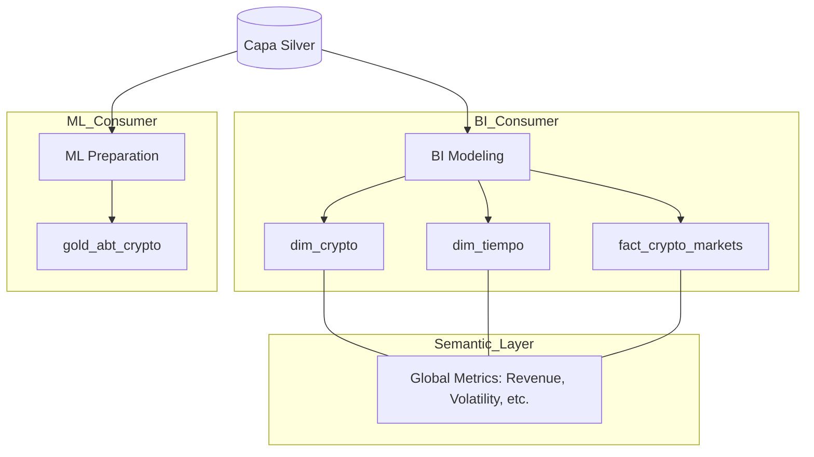
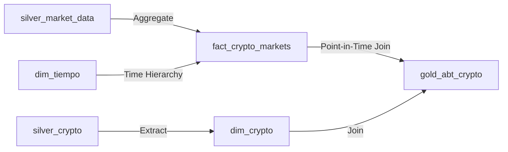

# Clase 05: La Bóveda (Capa Gold)

> 📚 **Cómo está estructurada esta clase** (patrón compartido por clase03/04/05):
>
> 1. **Notebook teórico** ([`clase05.ipynb`](clase05.ipynb)) — conceptos + DAGs demo + página dashboard sobre datos sintéticos (`silver.ventas_demo`)
> 2. **Ejercicio práctico (con entrega)** ([`ejercicios/ejercicio.ipynb`](ejercicios/ejercicio.ipynb)) — **11 ítems**: 9 ejercicios de **SQL Gold** sobre **Northwind** (G1–G8 + G11: agregaciones, JOIN *star*, CASE, ranking, LAG) + **G9** (tu propia tabla Gold) + **G10** (tu página Streamlit)
> 3. **DAG productivo** ([`ejercicios/dag_crypto_gold.py`](ejercicios/dag_crypto_gold.py)) — para copy-paste a Airflow

> **Material de la clase**:
> - [`clase05.ipynb`](clase05.ipynb) — desarrollo teórico + 2 DAGs pedagógicos progresivos (`gold_01_star_basico.py`, `gold_02_abt.py`) generados vía `%%writefile`, y el **consumo** de las dos audiencias de Gold (BI y ML) graficado en el propio notebook.
> - [`ejercicios/ejercicio.ipynb`](ejercicios/ejercicio.ipynb) — **el ejercicio entregable**, un solo archivo autocontenido con **11 ítems**: **Parte 1** carga **Northwind** (dual-engine Postgres/DuckDB), **Parte 2** son **9 ejercicios de SQL Gold** (G1–G8 + G11: GROUP BY+agregaciones, HAVING, JOIN tipo *star*, CASE buckets, ROW_NUMBER/RANK, % del total, variación temporal con LAG) y **Parte 3** es tu propia capa Gold: **G9** (diseñás y materializás **tu tabla Gold**: grano + `CREATE TABLE` tipado + PK + `INSERT INTO ... SELECT`) y **G10** (**tu página Streamlit** que la consume). La **📦 Entrega** se deriva ejecutando tus queries y verificando tu tabla y tu página (sin autoreporte) → son **DOS archivos**: el `.txt` en `ejercicios/estudiantes/` **+** tu página `ejercicios/dashboard/pages/7_<apellido>-<nombre>.py` (ver [`ejercicios/README.md`](ejercicios/README.md)).
> - [`ejercicios/dag_crypto_gold.py`](ejercicios/dag_crypto_gold.py) — DAG productivo, se copia al stack al final del ejercicio.
> - [`ejercicios/dashboard/pages/`](ejercicios/dashboard/pages/) — acá cada estudiante crea **su propia página** (`7_<apellido>-<nombre>.py`, ejercicio G10), que **sí** se commitea junto con el `.txt`. Las páginas de **referencia** no se duplican acá: son las del dashboard del curso, en [`stack/dashboard/pages/`](../stack/dashboard/pages/), las mismas que ya ves corriendo en `localhost:8501`.

---

## 🔁 Continuidad con la clase 04

En la **clase 04** cargamos `silver.crypto_markets` con datos limpios validados contra el contrato `crypto_markets.yaml`, más una tabla `silver.quarantine_*` para los registros que fallaron Pydantic. En **Gold** consumimos `silver.crypto_markets` (NO `bronze.*`) y la transformamos en un modelo dimensional listo para BI (`dim_*` + `fact_*`) + una **ABT** lista para ML.

> **Decisión arquitectural** (excepción documentada): `fact_global_market` lee de `bronze.global_market` **directo**, salteándose Silver. Razón: el dato macro ya viene agregado por la API de CoinGecko (no son filas individuales que validar) y Silver no agrega valor. Está documentado en [`ejercicios/dag_crypto_gold.py`](ejercicios/dag_crypto_gold.py).

---

## 🎯 Objetivos

- Modelar datos para negocio usando el **Star Schema** (Hechos y Dimensiones).
- Construir tablas **ABT (Analytical Base Tables)** optimizadas para Machine Learning.
- Comprender la importancia de la **Capa Semántica** y las métricas gobernadas.
- Asegurar la **integridad referencial** total en la capa final.

---

## 🏗️ Arquitectura de la Capa Gold


```mermaid
graph TD
    S[(Capa Silver)] --> B[BI Modeling]
    S --> M[ML Preparation]

    subgraph BI_Consumer
        B --> D1[dim_crypto]
        B --> D2[dim_tiempo]
        B --> F1[fact_crypto_markets]
    end

    subgraph ML_Consumer
        M --> A[gold_abt_crypto]
    end

    subgraph Semantic_Layer
        D1 --- SL
        D2 --- SL
        F1 --- SL
        SL[Global Metrics: Revenue, Volatility, etc.]
    end
```

## 🗺️ Linaje de Datos (Gold)

En Gold, los datos se denormalizan para facilitar el consumo:


```mermaid
graph LR
    S1[silver_crypto] -->|Extract| D1[dim_crypto]
    S2[silver_market_data] -->|Aggregate| F1[fact_crypto_markets]
    S3[dim_tiempo] -->|Time Hierarchy| F1

    F1 -->|Point-in-Time Join| A[gold_abt_crypto]
    D1 -->|Join| A
```

---

## 🚀 Setup

- Stack de la **Clase 02** corriendo (`docker compose up -d` desde `stack/`).
- Datos de Silver ya cargados (los generaste en la **Clase 04** corriendo el `dag_crypto_silver.py`).

**Sincronizá tu rama con el material nuevo.** Cada clase trae material nuevo en `main`. Antes de empezar a trabajar, traete los cambios:

```bash
# 1. Bajar lo nuevo de main
git checkout main
git pull origin main

# 2. Volver a tu rama personal y mergear
git checkout estudiante/apellido-nombre   # reemplazá por tu rama
git merge main --no-edit
```

> Vas a repetir esto al empezar **cada** clase. El detalle de cada comando está en el [README raíz](../README.md), sección "Cómo Consumir el Repo Semana a Semana".

---

## 📋 Cómo trabajar la clase

### Paso 1 — Leer el notebook teórico y correr los DAGs pedagógicos

Abrí `clase05.ipynb`. La primera parte explica conceptos (Star Schema, Capa Semántica, ABT, Best Practices). La parte final tiene **2 cells `%%writefile`** que generan los DAGs pedagógicos (datos sintéticos), y cierra **consumiendo** esas tablas desde el propio notebook:

| # | Archivo generado | Path destino | Qué introduce |
|---|---|---|---|
| 01 | `gold_01_star_basico.py` | `stack/dags/03-gold/` | Star Schema básico **en SQL (ELT)**: `dim_producto_demo` + `dim_tiempo_demo` + `fact_ventas_demo` con FKs vía `JOIN` (surrogate key con `ROW_NUMBER()`) |
| 02 | `gold_02_abt.py` | `stack/dags/03-gold/` | ABT (wide table) para ML **en SQL (ELT)**: features vía `GROUP BY` + segmentación con `CASE WHEN` + verificación real del grano |

> **¿Y las páginas Gold del dashboard (`3_Gold_Mercado.py`, `4_Gold_Velas.py`, `5_Gold_Analisis.py`, `6_Gold_ML.py`)?** No se generan desde el notebook: **ya vienen en el stack**, en [`stack/dashboard/pages/`](../stack/dashboard/pages/), y se sirven con bind-mount. La única que agregás vos es la tuya de **G10** (`7_<apellido>-<nombre>.py`).

Después de correr las celdas, los DAGs aparecen en Airflow UI (`localhost:8080`) — filtrá por tag **`gold`** para verlos juntos. La última sección del notebook lee esas tablas y las grafica ahí mismo.

> **Convenciones aplicadas** (consistente con ejercicios 03/04):
> - **Carpeta**: cada DAG vive en la capa Medallion destino (`03-gold/` para todo lo que escribe a `gold.*`).
> - **Tags**: sintéticos didácticos llevan `tags=["gold"]`. El productivo crypto lleva `tags=["prod", "gold", "crypto"]` — filtrá por `prod` en la UI para verlo separado de los didácticos.
> - **Numeración**: `gold_NN_xxx.py` con prefijo letra (igual que `bronze_NN_xxx.py` y `silver_NN_xxx.py`). Evita el bug histórico de Airflow con archivos que arrancan con dígito. Las páginas Streamlit del dashboard (`1_Bronze_Ingesta.py` … `6_Gold_ML.py`) SÍ arrancan con dígito porque es la **convención de orden de Streamlit** (no Airflow).

### Paso 2 — Hacer el ejercicio práctico (con entrega)

Abrí `ejercicios/ejercicio.ipynb` (un solo archivo): corré la **Parte 1 — Setup** (carga Northwind, dual-engine Postgres/DuckDB), resolvé los **9 ejercicios de SQL Gold** de la **Parte 2** (G1–G8 + G11: agregaciones que **colapsan el grano** para responder preguntas de negocio — el inverso de Silver en la clase 04 — más variación temporal con `LAG`) y cerrá con la **Parte 3**: **G9** (tu tabla Gold: grano + `CREATE TABLE` tipado + PK + `INSERT INTO ... SELECT`) y **G10** (tu página Streamlit `7_<apellido>-<nombre>.py`). Al final, la sección **📦 Entrega** **ejecuta tus `query_g1..query_g8` y `query_g11` y verifica tu tabla y tu página** y genera automáticamente `ejercicios/estudiantes/<apellido>-<nombre>.txt` (motor + evidencia de Northwind + qué ítems dieron resultado, extraído de tus queries, **no autoreportado**). La entrega son **DOS archivos** — el `.txt` **+** tu página `ejercicios/dashboard/pages/7_<apellido>-<nombre>.py` — y se suben con commit + push: tu PR se actualiza solo. Reglas completas en [`ejercicios/README.md`](ejercicios/README.md).

**Commit y push.** Son **dos** archivos: el `.txt` y tu página de G10. Desde la raíz del repo:

```bash
git add clase05/ejercicios/estudiantes/<apellido>-<nombre>.txt clase05/ejercicios/dashboard/pages/7_<apellido>-<nombre>.py
git commit -m "ejercicio05: sql gold + tabla y pagina propia"
git push origin estudiante/apellido-nombre
```

> ⚠️ **No** uses `git add .` ni commitees el `.ipynb` modificado — es un template compartido entre todos los estudiantes. Tu página **sí** se commitea: es un archivo único por estudiante.

> **Una rama para siempre, un PR para siempre**: tu rama `estudiante/apellido-nombre` y tu PR son los mismos desde la Clase 01; el push actualiza ese mismo PR (no abrís uno nuevo). Detalle en el [README raíz](../README.md).

### Paso 3 — Deploy del DAG productivo crypto

El DAG productivo de Gold (ahora **SQL ELT**, ver su header) se deploya copiándolo al stack — Airflow lo detecta solo:

```bash
# DAG productivo (escribe gold.* desde silver/bronze)
cp clase05/ejercicios/dag_crypto_gold.py stack/dags/03-gold/
```

Las **páginas Gold del dashboard ya vienen en el stack** (`stack/dashboard/pages/`): no hay nada que copiar. La única página que vos agregás es la tuya de **G10**:

```bash
# Tu pagina de G10 (opcional: para verla corriendo; la verificacion es estatica)
cp clase05/ejercicios/dashboard/pages/7_<apellido>-<nombre>.py stack/dashboard/pages/
```

El DAG **arranca solo** (`is_paused_upon_creation=False`): apenas Airflow lo detecta se suma a la **cadena data-aware**: se dispara cuando `crypto_silver` actualiza el asset `silver_crypto_markets`, sin cron propio. En la corrida siguiente vas a ver `gold.dim_crypto`, `gold.dim_tiempo`, `gold.fact_crypto_markets`, `gold.fact_global_market` y `gold.gold_abt_crypto` poblándose con datos reales, más las **14 vistas semánticas** `gold.v_*` que crea la task `build_views` — la "API pública" de Gold que consumen el dashboard y el modelo. Van en tres grupos:
>
> - **Agregan a día**: `v_series_diaria`, `v_ohlc_diario`, `v_metricas_riesgo`, `v_amplitud_mercado`, `v_kpis_mercado`, `v_ohlc_mercado` (la vela del mercado entero, no la suma de las 50).
> - **Conservan el grano fino de snapshot**: `v_ultimo_snapshot`, `v_intradia`, `v_global_serie`, `v_concentracion`, `v_mercado_24h` (el 24 h calculado por nosotros al lado del que manda la API) y `v_mercado_contexto` (dónde cae el valor de hoy en la serie acumulada).
> - **Cortan por una dimensión**: `v_estacionalidad` (por `dim_tiempo`) y `v_por_categoria` (por `dim_crypto`). Son la misma pregunta con dos `GROUP BY` distintos, y existen para que el star schema se vea **funcionando** y no solo dibujado.
>
> Las del segundo grupo existen porque con pocos días de historia un análisis diario tiene 3 puntos y uno intradía tiene ~200: el pipeline ya recolecta cada 15 minutos, tirar esa resolución es gratis de evitar. Refrescá `localhost:8501` y las páginas Gold pasan de vacías a pobladas.

> El `docker-compose.yml` del stack tiene `./dashboard/pages:/app/pages` como bind-mount, así que el `cp` se ve en vivo sin rebuild de la imagen.
>
> ⚠️ **Ojo: el bind-mount es SOLO `pages/`.** `theme.py`, `db.py` y `app.py` van `COPY` dentro de la imagen (ver el `Dockerfile`). Si tocás uno de esos, editarlo y reiniciar el contenedor **no hace nada**: hay que `docker compose build dashboard`. Es un error fácil de cometer y difícil de ver, porque no falla — simplemente seguís mirando la versión vieja.

---

## 🎨 Dashboard incluido en el stack

El stack levanta un **dashboard de Streamlit** (`http://localhost:8501`) desde la **Clase 02**. Las páginas están **ordenadas por capa** — se leen de arriba hacia abajo como se lee el pipeline — y cada una responde **una** pregunta:

| # · Página | Pregunta que responde | Lee de |
|---|---|---|
| **1 · 🥉 Bronze — Ingesta** | ¿Llegó el dato? | `bronze.crypto_markets` |
| **2 · 🥈 Silver — Calidad** | ¿Sirve el dato? | `silver.crypto_markets` + `silver.quarantine_*` vs `bronze.*` |
| **3 · 🥇 Gold — Mercado** | ¿Qué dice el negocio? | `gold.v_kpis_mercado`, `gold.v_ultimo_snapshot`, `gold.v_mercado_24h`, `gold.v_mercado_contexto` |
| **4 · 🥇 Gold — Velas** | ¿Cómo se movió el mercado, y cada activo? | `gold.v_ohlc_mercado`, `gold.v_ohlc_diario` |
| **5 · 🥇 Gold — Análisis** | ¿Qué estructura hay detrás? | `gold.v_metricas_riesgo`, `gold.v_amplitud_mercado`, `gold.v_intradia`, `gold.v_concentracion`, `gold.v_estacionalidad`, `gold.v_por_categoria` |
| **6 · 🤖 Gold — ML** | ¿El modelo sirve? | `gold.v_ml_veredicto`, `gold.v_ml_aciertos`, `gold.v_volatilidad_diaria`, `gold.gold_abt_crypto` |
| **7 · 👤 Tu página (G10)** | la que vos elijas | **tu** tabla Gold de G9 |

Dos cosas para notar, porque son **doctrina** y no detalle de implementación:

- **Los KPIs de las páginas 3–6 salen de vistas `gold.v_*`, no de tablas.** Esa es la **capa semántica** — la **API pública** de Gold: la métrica se define **una sola vez, en SQL**, y no se recalcula en cada página. Si mañana cambia la definición de "dominancia", cambia en un lugar.
  Hay tres excepciones, y son deliberadas: la página 3 lee `gold.dim_crypto` para llenar el selector de categorías (es la dimensión, no una métrica), y la 6 lee `gold.gold_abt_crypto` y `gold.predicciones` **porque su tema ES la ABT y la tabla de predicciones** — no las está consumiendo, las está mostrando.
- **La demo de ventas NO es una página del dashboard, y es deliberado.** Esas tablas `gold.*_demo` son **sintéticas**: el dashboard muestra el pipeline **productivo** de criptomonedas, y mezclarle una demo de juguete confunde las dos cosas. El notebook de la clase la grafica ahí mismo — el patrón de consumo es idéntico, lo que cambia es dónde vive.

### ¿Querés agregar tu propia visualización?

Eso es exactamente **G10**. Tu página va en `clase05/ejercicios/dashboard/pages/7_<apellido>-<nombre>.py`: esa es la que se entrega. Streamlit detecta cualquier `.py` que pongas en `stack/dashboard/pages/` (el prefijo define el orden, y el curso ya ocupa `1_` a `6_`), así que para verla corriendo copiala ahí:

```bash
cp clase05/ejercicios/dashboard/pages/7_<apellido>-<nombre>.py stack/dashboard/pages/
# Refrescá Streamlit: aparece sola, sin rebuild
```

> Para los mínimos de G10 usá `st.metric`, `st.selectbox` y un gráfico de Streamlit. Las páginas del curso arman sus KPIs y filtros con helpers propios de `theme.py`, que el verificador no cuenta: sirven para ver cómo traen los datos, no como molde para copiar entero.

---

## ✅ Verificación end-to-end

Después de correr `gold_01_star_basico` + `gold_02_abt` (sintéticos) + `dag_crypto_gold` (productivo), deberías poder responder estas 3 queries:

```sql
-- 1. ¿Las 5 tablas Gold productivas tienen datos?
SELECT 'dim_crypto'           AS tabla, COUNT(*) AS filas FROM gold.dim_crypto
UNION ALL
SELECT 'dim_tiempo',           COUNT(*) FROM gold.dim_tiempo
UNION ALL
SELECT 'fact_crypto_markets',  COUNT(*) FROM gold.fact_crypto_markets
UNION ALL
SELECT 'fact_global_market',   COUNT(*) FROM gold.fact_global_market
UNION ALL
SELECT 'gold_abt_crypto',      COUNT(*) FROM gold.gold_abt_crypto;
-- Esperado: las 5 con filas > 0

-- 2. Integridad referencial: ¿hay registros huérfanos en fact_crypto_markets?
SELECT COUNT(*) AS huerfanos
FROM gold.fact_crypto_markets f
LEFT JOIN gold.dim_crypto d ON f.crypto_id = d.crypto_id
WHERE d.crypto_id IS NULL;
-- Esperado: 0

-- 3. ¿La ABT tiene todas las features?
SELECT column_name
FROM information_schema.columns
WHERE table_schema = 'gold' AND table_name = 'gold_abt_crypto'
ORDER BY ordinal_position;
-- Esperado: 30 columnas = 28 features + _processed_at + _source_table
-- (id, current_price, market_cap, total_volume, price_std, supply_ratio,
--  ath_distance_pct, volatility_category, market_cap_tier, ...)
```

Si las 3 queries devuelven valores razonables, tu pipeline Gold está **funcional + íntegro + listo para consumo BI/ML**.

---

## 🔮 Forward reference a clase 06 (MLOps)

**Clase 06** es la **clase de cierre del cuatrimestre** — workshop magistral, sin entrega comprometida. El objetivo es **consolidar lo aprendido y ver el cuadro completo**. Lo que vas a ver:

- **Recap del cuatrimestre**: tabla + diagrama Mermaid del pipeline completo (Bronze→Silver→Gold→ML) + decisiones técnicas clave de cada capa + errores típicos / lecciones aprendidas.
- **Workshop ML sobre Gold**: predecir **qué criptos van a ser las más movidas mañana**, con validación honesta (walk-forward por fechas) y baseline explícito. Incluye la lección de por qué predecir la *dirección* del precio no funciona, y una sobre **target leakage**.
- **Tracking con MLflow**: registrar runs (params + metrics + modelos), un modelo por ventana de historia con su alias `@champion`, y la UI en `localhost:5000`.
- **Monitoring E2E del pipeline**: tres niveles de observabilidad (infra / datos / negocio), dashboard Streamlit como cierre del ciclo, health check SQL del pipeline completo.
- **Orquestación E2E**: un Master DAG (`crypto_pipeline_e2e`) dispara Bronze→Silver→Gold en cascada con `TriggerDagRunOperator`. **Caveat pedagógico explícito**: es el patrón más simple para *enseñar* orquestación entre DAGs; en producción real con frecuencias distintas se usa **Airflow Datasets** (data-aware scheduling) o **decoupling por idempotencia**. La clase explica las 3 alternativas con tabla comparativa.
- **Bonus Track MLOps**: mapa de Feature Stores, Model Registry, Drift Detection, Training-Serving Skew. No se enseña — es la próxima frontera.

> 🔁 **El círculo Medallion se cierra**: el contrato YAML que validó la **forma** del archivo en Bronze (clase 03) y la **semántica** de cada fila en Silver (clase 04) culmina en Gold con la **integridad referencial** del modelo dimensional (clase 05). En clase06 consumimos ese output para entrenar ML productivo + ver el cuadro completo. **Un solo contrato, cuatro capas, cuatro responsabilidades**.

---

## 🛠️ Troubleshooting

| Problema | Solución |
| :--- | :--- |
| El DAG no aparece en Airflow UI | Verificar que el archivo esté en `stack/dags/03-gold/`. Esperar 10-30s para que Airflow lo detecte. |
| El DAG corre pero las tablas Gold están vacías | Verificá que `crypto_silver` (clase 04) haya corrido antes y poblado `silver.crypto_markets`. |
| `IntegrityError: foreign key violation` | El DAG verifica integridad. Mirá la tabla `dim_crypto` — todos los `crypto_id` de `fact_crypto_markets` tienen que existir en `dim_crypto`. |
